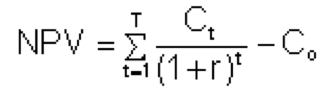

Title: Return On Investment
Date: 2016-09-03
Category: Blog
Tags: Accounting; Finance; Investing; ROI;
Slug: return-on-investment
Status: draft

I thought I understood what Return on Investment meant.  I had a conceptual understanding.  It's was a percent of how much you gained compared to your initial investment.  For a multi-year investment I would divide the percent by the number of years (or periods) to have an average ROI.  This suited me well until I ran across the term Internal Rate of Return.  It didn't make sense to me.  I had a level-1 understanding of it.

This was the provided calculation by [Investopedia](http://www.investopedia.com/terms/i/irr.asp) for calculating Internal Rate of Return.  I can figure out a formula but the numbers don't mean anything unless you have an appreciation for what it represents.  I also didn't understand why my ROI/term (or average ROI, AROI) was wrong.  As I kept studying I also found a Compound Annual Growth Rate or CAGR that was different than my AROI.  Thus, this blog post was my work towards understanding if further.

The [Motley Fool had a great example on IRR](http://www.fool.com/knowledge-center/the-difference-between-internal-rate-of-return-and.aspx) but it's comparison to ROI was rather weak in that it took the trivial approach of total ROI as opposed to AROI.

So, here's the original spreadsheet from The Motley fool.

|                | Year 1 | Year 2 | Year 3 | Year 4 |
|----------------|:------:|:------:|:------:|:------:|
| Purchase       |   -100 |        |        |        |
| Brokerage Fees |     -5 |        |        | -5     |
| Dividend       |        | 5      | 5      | 5      |
| Sales          |        |        |        | 165    |
| Taxes          |        |        |        | -13    |
| Net Cash Flow  |   -105 | 5      | 5      | 152    |

So for a \$105 investment you gain \$162 (Year2+Year3+Year4) for a gain of \$57 and Return on Investment rate of 54.29% over 3 years or an Average ROI of 18.09%.  This was the number that I originally used to calculate return, it's what made sense to me intrinsically before any study.  When I calculated the Internal Rate of Return I got 16.16%.  A difference of 1.93% isn't trivial.

It didn't help matters when I came across the Compound Annual Growth Rate (CAGR).  Again, image courtesy of [Investopedia](http://www.investopedia.com/terms/c/cagr.asp)

[{.alignnone .size-medium .wp-image-181 width="300" height="73"}](https://kennethfarr.com/wp-content/uploads/2016/09/CAGRFormula1.gif)

Calculating the CAGR gave the same investment above an interest rate of 15.55%.  So now I'm left with three different interest rates that differ far too much for my liking.

  ------ --------
  IRR    16.16%
  AROI   18.09%
  CAGR   15.55%
  ------ --------

The next step was to calculate the summation portion of the IRR formula and see what it looks like for each year.  The summation formula can be broken down to

[0 = P0 + P1/(1+IRR) + P2/(1+IRR)2 + P3/(1+IRR)3 + . . . +Pn/(1+IRR)n]{data-sheets-value="{"1":2,"2":"0 = P0 + P1/(1+IRR) + P2/(1+IRR)2 + P3/(1+IRR)3 + . . . +Pn/(1+IRR)n"}" data-sheets-userformat="{"2":4673,"3":{"1":0},"9":0,"12":0,"15":"Times New Roman"}"}

which may be easier for some to understand.  Doing this for each year resulted in the following.

  ---------------- --------------------------------- ---------------------------------------- ---------------------------------------- ----------------------------------------
                   Year 1                            Year 2                                   Year 3                                   Year 4
  Purchase         -100                                                                                                                
  Brokerage Fees   -5                                                                                                                  -5
  Dividend                                           5                                        5                                        5
  Sale                                                                                                                                 165
  Taxes                                                                                                                                -13
  Net Cash Flow    -105                              5                                        5                                        152
                   [-105]{style="color: #ff0000;"}   [4.304576716]{style="color: #ff0000;"}   [3.705876141]{style="color: #ff0000;"}   [96.98954714]{style="color: #ff0000;"}
  ---------------- --------------------------------- ---------------------------------------- ---------------------------------------- ----------------------------------------

Adding up the numbers in red results in 0, the Net Present Value (NPV).  This shows that the interest rate calculated by Excel of 16.16% was correct.  The epiphany for me was realizing that the \$5 dividend earned in Year 2 wasn't worth \$5 in Present Value, rather \$4.30.  In Year 3 the same \$5 is worth \$3.70 and so on.  So IRR takes the Time Value of Money into account, or as Buffett puts it, "A bird in the hand is worth two in the bush".  He of course got that from [Aseop's Fables](http://www.best-childrens-books.com/a-bird-in-the-hand.html) but none the less, it's part of his M.O.

So now understanding why IRR is different is great, it takes time value of money into account when factoring interest rates.  But now I still didn't understand why AROI and CAGR were different.

I explored AROI v CAGR interest rates for the same numbers over different year periods.

  ------------- -------- -------- -------- -------- --------
   Year         1        2        3        4        5
  Average ROI   54.29%   27.14%   18.10%   13.57%   10.86%
  CAGR          54.29%   24.21%   15.55%   11.45%   9.06%
  Difference    0.00%    2.93%    2.54%    2.12%    1.80%
  ------------- -------- -------- -------- -------- --------

Here, as the years went on it looks like the difference between the interest rates would converge.  I then realized that CAGR took compounding into account while AROI did not.  This explains why you can get the same end value with a lower interest rate.  It's obvious in hind-site.

Here are the non-compounded interest rates from above, calculated each year to confirm that for Year 2, an interest rate of \$27.14 not compounded over 2 years with a starting investment of \$105 results in an end value of \$162.

  -------- -------- -------- -------- --------
           Year 2   Year 3   Year 4   Year 5
  Rate     27.14%   18.10%   13.57%   10.86%
  Year 0   105      105      105      105
  Year 1   133.5    124      119.25   116.4
  Year 2   162      143      133.5    127.8
  Year 3            162      147.75   139.2
  Year 4                     162      150.6
  Year 5                              162
  -------- -------- -------- -------- --------

 

The same chart using the CAGR interest rate and compounding each year, a lower interest rate produces the same results.

  -------- ------------- ------------- ------------- -------------
           Year 2        Year 3        Year 4        Year 5
  Rate     24.21%        15.55%        11.45%        9.06%
  Year 0   105           105           105           105
  Year 1   130.4223907   121.3289775   117.0228654   114.5129076
  Year 2   162           140.1973407   130.4223907   124.8876764
  Year 3                 162           145.3562083   136.20239
  Year 4                               162           148.5422067
  Year 5                                             162
  -------- ------------- ------------- ------------- -------------

 

The only difference here is the compound formula.  For the original equation, unless those dividends were reinvested it wouldn't make sense to use the CAGR since they were indeed not compounded.  And if they were reinvested, would need to be +5 for dividend payout and -5 for dividend reinvestment, resulting in a net of \$0 for that year.

For me, having a practical understanding of what these different terms means is important.  I'm running through examples like this until I have a good grasp of financial accounting.  So, use Internal Rate of Return when you have cash flowing in and out of an investment and Compound Annual Growth Rate when you want to know the interest rate of a compounding investment.  Don't use Annual Return on Investment since its triviality makes it useless.
